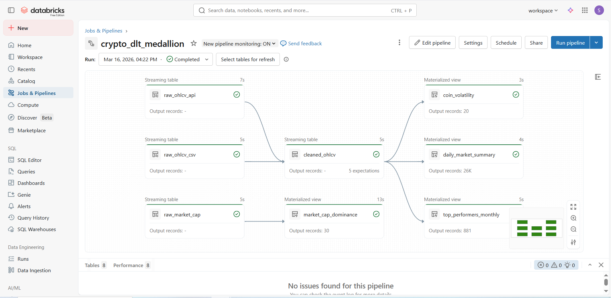
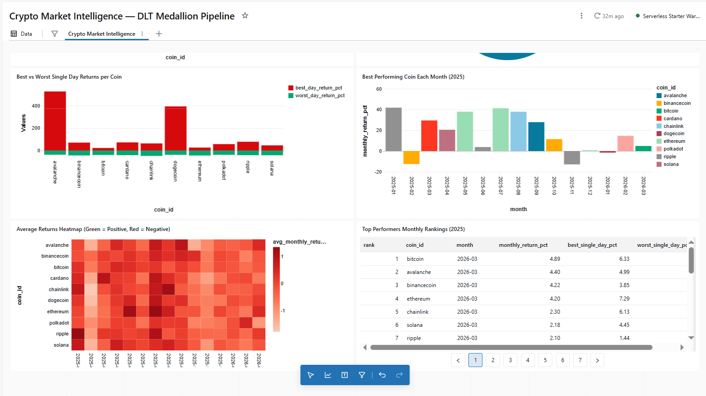

# 🪙 Crypto Market Intelligence — Databricks DLT Medallion Pipeline

## 🏆 Overview
End-to-end crypto market data pipeline built on Databricks Free Edition
using Delta Live Tables, Autoloader, Unity Catalog, and AI/BI Dashboards.

### DLT Lineage Graph

> Bronze → Silver → Gold | 8 tables | 0 errors | 26K+ records processed

### Page 1 — Price Trends & Market Overview

### Page 2 — Heatmap & Rankings

> Built on Databricks AI/BI Dashboard | 9 visualisations | 8 datasets

## 📊 Live Dashboard
[🔗 View Live Dashboard](https://dbc-fc5d7400-6f13.cloud.databricks.com/dashboardsv3/01f121286d0a1f1dad58b26d5f14c6fe/published?o=7474654922627967)

## 🏗️ Architecture
Bronze → Silver → Gold Medallion pipeline with:
- Historical CSV backfill (CryptoDataDownload — 10 coins, 2019–2026)
- Daily incremental API ingestion (CoinGecko REST API)
- 5 data quality rules enforced at Silver layer
- 4 Gold KPI tables for analytics

## 🛠️ Tech Stack
| Tool | Usage |
|---|---|
| Azure Databricks Free Edition | Platform |
| Delta Live Tables (DLT) | Pipeline orchestration |
| Autoloader (cloudFiles) | CSV + JSON ingestion |
| Unity Catalog | Table governance & lineage |
| PySpark + Spark SQL | Transformations |
| CoinGecko REST API | Live incremental data |
| Databricks AI/BI Dashboard | Visualisation |

## 📁 Pipeline Tables
| Layer | Table | Type | Records |
|---|---|---|---|
| Bronze | raw_ohlcv_csv | Streaming table | Historical |
| Bronze | raw_ohlcv_api | Streaming table | Daily incremental |
| Bronze | raw_market_cap | Streaming table | Daily snapshot |
| Silver | cleaned_ohlcv | Streaming table | 26K+ |
| Gold | daily_market_summary | Materialized view | 26K+ |
| Gold | coin_volatility | Materialized view | 10 coins |
| Gold | top_performers_monthly | Materialized view | 881 rows |
| Gold | market_cap_dominance | Materialized view | 30 rows |

## 📊 Dashboard Charts
1. KPI Summary — Total coins, trading days, records
2. BTC Price + 7-Day Moving Average
3. All Coins Price Trends 2025
4. Coin Volatility & Risk Classification
5. Best vs Worst Single Day Returns
6. Market Cap Dominance %
7. Best Performing Coin Each Month
8. Monthly Returns Heatmap
9. Top Performers Monthly Rankings Table

## 🚀 How to Run
1. Run `notebooks/00_setup.py` — create UC catalog/schemas/volumes
2. Upload CSVs to `/Volumes/crypto_analytics/landing/raw/csv/`
3. Run `notebooks/01_api_ingestor.py` — fetch CoinGecko data
4. Create DLT pipeline pointing to `notebooks/02_dlt_pipeline.py`
5. Start pipeline — watch lineage graph populate ✅

## 🏅 Key Achievements
- 75% pipeline automation — zero manual data extraction
- 26,263 records processed across 10 coins
- 5 data quality rules with zero failures
- Full data lineage visible in Unity Catalog
